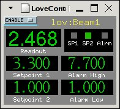
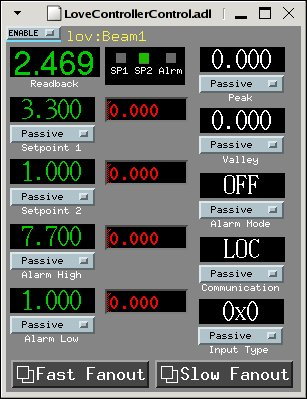
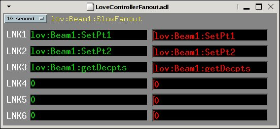

love: Love Controller Driver Support
====================================

**Release 3-2-3**

**David Kline**

**June 2006**

###   
  

* * *

License Agreement
-----------------

This product is available via the [open source license](#LicenseAgreement) described at the end of this document.

* * *

Overview
--------

This module is part of synApps to provide support for the Love Controllers. It consists of MEDM screens, an Asyn-based multi device port driver, and a database. The MEDM screens provide a way for viewing the controller values as well as controlling some of its configuration. The port driver binds generic Asyn device support for EPICS records with the Asyn serial port driver (drvAsynSerialPort). The database defines EPICS records, that read/write controller values and configuration settings.  
  
The Love Controller is an instrument that can be used to monitor temperature, pressure, serve as a thermocouple, or control pressure, flow, humidity, motion, or pH given the proper hardware. The control functions, such as selecting the input type (voltage, current, etc.), are programmed from the front panel. Communication with the controller is a half-duplex, multi drop, RS-485 serial bus. Refer to the documentation for additional information about the features and programmability of the instrument. There are several controller models available providing different options and features, however, this software supports models 16A and 1600.

* * *

Files
-----

The files listed below are the primary ones in the identified directory.

 

.

start\_epics\_love

Main MEDM screen startup.

  
  

 

./documentation

devAsynLoveCrossTraining.ppt

Power point presentation given during a BCDA group meeting.

devAsynLove.ppt

Power point presentation given during the EPICS collaboration meeting in Spring of 2005 ([click here](http://www-ssrl.slac.stanford.edu/lcls/epics/agenda.php)).

loveDriver.html

This document.

loveKnownIssues.html

List of known issues for each release.

loveReleaseNotes.html

Notes for current and previous releases.

WIRING

Diagram for wiring the controllers and other information.

  
  

 

./documentation/1600

1600\_Calibration.pdf

Calibration document for the 1600.

1600\_CommProtocol.pdf

Communication protocol/commands for the 1600.

1600\_Documentation.pdf

Users manual.

  
  

 

./documentation/16A

16A\_Calibration.pdf

Calibration document for the 16A.

16A\_CommDoc.pdf

Communication protocol/commands for the 16A.

16A\_CommProtocol.pdf

Instructions about how to write your own application to communicate with the 16A.

16A\_DataSheet.pdf

General information.

16A\_Documentation.pdf

Users manual.

16A\_FlowChart.pdf

Programming flow chart.

  
  

 

./documentation/485LDRC

485LDRC\_Connections.gif

Wiring diagram.

485LDRC\_Datasheet.pdf

General information.

485LDRC\_Dimentions.gif

Installation diagram.

  
  

 

./iocBoot/ioclove

st.cmd.linux

Startup script for Linux-based IOCs.

st.cmd.vx

Startup script for vxWorks-based IOCs.

  
  

 

./loveApp/Db

LoveControllerControl.db

PVs for setting controller configuration.

LoveController.db

PVs for reading information from the controller.

Love\_settings.req

Request file for auto save/restore.

  
  

 

./loveApp/op/adl

LoveController.adl

Main read back screen.

LoveControllerControl.adl

Displays additional read back and configuration information.

LoveControllerFanout.adl

Displays PV and rate information.

  
  

 

./loveApp/src

drvLove.c

Asyn-based multi device port driver.

loveAppCommonInclude.dbd

Basic database definition from base, Asyn, and for Love controller support.

loveAppInclude.dbd

Primary database definition file.

loveAppVXInclude.dbd

vxWorks-specific database definition file.

devLove.dbd

Necessary for other components to import Love Controller support.

  
  

* * *

MEDM Screens
------------

When the script 'start\_epics\_love' is executed, the main controller screen is displayed (see below). It displays the values that are of most interest to the user. These values include the read back, set points, alarm limits, and indicates whether the controller is in alarm. The 'ENABLE' menu provides a means for disabling/enabling record processing. When disabled the records will not be processed and no data acquisition will be performed.  
  
  

  
  
A hidden menu is available in the upper right hand corner of the main screen. It displays additional values, such as input type and communication status, as well as allows one to make adjusts to some of the configuration parameters (i.e. set point 1 and scan rate). The display is illustrated below.  
  
  

  
  
Additionally, the “Fast Fanout” or “Slow Fanout” message buttons launch other screens that list which PVs are being acquired and at what rate. The user can enter additional PVs or change the data acquisition rate. Furthermore, it should be noted that once the IOC is rebooted, the fanout records will be reset to the original PVs. These displays are illustrated below. The corresponding database records require modification to preserve any changes made at runtime.  
  
  
  

  
  

  
  
  

* * *

drvLove
-------

The drvLove is a multi device port driver that binds standard EPICS device support with the underlying serial bus. It allows a virtual connection to an individual controller to provide a means for debugging the communication. The asynRecord can be used to select the tracing masks for debugging communication.  
  
The driver implements the asynDrvUser, asynCommon, asynInt32, and asynUInt32Digital interfaces.

*   asynDrvUser – Describes the methods to allow an asynUser to communicate user specific information to/from the port driver.
    
*   asynCommon – Describes the methods that must be implemented by drivers for reporting driver information and how to connect or disconnect from the driver.
    
*   asynInt32 – Describes the methods that use integers for communicating with a device.
    
*   asynUInt32Digital – Describes the methods for communicating via bits of an Int32 register.
    

* * *

Database
--------

  

The database consists of records for processing data received by the controllers. Records are categorized as base, composite, and rate. Base records provide integer-based values that are read from a controller and include values such as the number of decimal points, set point 1 and 2, alarm high and low, and status. Composite records take as input base records to derive floating point representations of the values. For example, set point 1 is a calc record that receives as input the decimal points and the set point record values, then uses its CALC equation to determine the final floating point set point value. By default, both the base and composite records are process passive and are processed using fanout records. The fanout records are used to “drive” the processing rate of the base and composite records. At the moment there are two fanout records for fast and slow record processing, their scan rates can be adjusted from MEDM [screens](#Fanout) . **Note** that the “getDecpts” PV must be in the “Fast” fanout record at all times. This value is required since it is used by many PVs to derive their floating point value.

* * *

Operation
---------

The driver is initialized during IOC startup by calling the drvLoveInit method passing the driver name (i.e. “LO”) and the name of the serial port. The initialization method first connects with the serial port name and finds the asynOctet interface. Then it registers the port driver name with Asyn and the interfaces it supports (i.e. asynDrvUser, asynCommon, asynInt32, and asynUInt32Digital). The port driver must be made aware of the controller models on the serial bus. To do this the startup script calls the drvLoveConfig method passing the port driver name (i.e. “LO”), the controller address (i.e. 1..256), and the controller model string (i.e. “16A” or “1600”). After this, the database can be loaded creating the record instances that support the controllers.  
  
Prior to initializing the driver, Asyn and the underlying serial bus must be initialized. Refer to the target-specific startup script located in the iocBoot directory for details related to initialization.

* * *

License Agreement
-----------------

Copyright (c) 2004 University of Chicago and the Regents of the University of
California. All rights reserved.

synApps is distributed subject to the following license conditions:
SOFTWARE LICENSE AGREEMENT
Software: synApps
Versions: Release 4-5 and higher.

   1. The "Software", below, refers to synApps (in either source code, or
      binary form and accompanying documentation). Each licensee is addressed
      as "you" or "Licensee."

   2. The copyright holders shown above and their third-party licensor's hereby
      grant Licensee a royalty-free nonexclusive license, subject to the
      limitations stated herein and U.S. Government license rights.

   3. You may modify and make a copy or copies of the Software for use within
      your organization, if you meet the following conditions:
         1. Copies in source code must include the copyright notice and this
            Software License Agreement.
         2. Copies in binary form must include the copyright notice and this
            Software License Agreement in the documentation and/or other
            materials provided with the copy.

   4. You may modify a copy or copies of the Software or any portion of it, thus
      forming a work based on the Software, and distribute copies of such work
      outside your organization, if you meet all of the following conditions:
         1. Copies in source code must include the copyright notice and this
            Software License Agreement;
         2. Copies in binary form must include the copyright notice and this
            Software License Agreement in the documentation and/or other
            materials provided with the copy;
         3. Modified copies and works based on the Software must carry
            prominent notices stating that you changed specified portions of
            the Software.

   5. Portions of the Software resulted from work developed under a
      U.S. Government contract and are subject to the following license:
      the Government is granted for itself and others acting on its behalf a
      paid-up, nonexclusive, irrevocable worldwide license in this computer
      software to reproduce, prepare derivative works, and perform publicly and
      display publicly.

   6. WARRANTY DISCLAIMER. THE SOFTWARE IS SUPPLIED "AS IS" WITHOUT WARRANTY OF
      ANY KIND. THE COPYRIGHT HOLDERS, THEIR THIRD PARTY LICENSORS, THE UNITED
      STATES, THE UNITED STATES DEPARTMENT OF ENERGY, AND THEIR EMPLOYEES: (1)
      DISCLAIM ANY WARRANTIES, EXPRESS OR IMPLIED, INCLUDING BUT NOT LIMITED TO
      ANY IMPLIED WARRANTIES OF MERCHANTABILITY, FITNESS FOR A PARTICULAR
      PURPOSE, TITLE OR NON-INFRINGEMENT, (2) DO NOT ASSUME ANY LEGAL LIABILITY
      OR RESPONSIBILITY FOR THE ACCURACY, COMPLETENESS, OR USEFULNESS OF THE
      SOFTWARE, (3) DO NOT REPRESENT THAT USE OF THE SOFTWARE WOULD NOT
      INFRINGE PRIVATELY OWNED RIGHTS, (4) DO NOT WARRANT THAT THE SOFTWARE WILL
      FUNCTION UNINTERRUPTED, THAT IT IS ERROR-FREE OR THAT ANY ERRORS WILL BE
      CORRECTED.

   7. LIMITATION OF LIABILITY. IN NO EVENT WILL THE COPYRIGHT HOLDERS, THEIR
      THIRD PARTY LICENSORS, THE UNITED STATES, THE UNITED STATES DEPARTMENT OF
      ENERGY, OR THEIR EMPLOYEES: BE LIABLE FOR ANY INDIRECT, INCIDENTAL,
      CONSEQUENTIAL, SPECIAL OR PUNITIVE DAMAGES OF ANY KIND OR NATURE,
      INCLUDING BUT NOT LIMITED TO LOSS OF PROFITS OR LOSS OF DATA, FOR ANY
      REASON WHATSOEVER, WHETHER SUCH LIABILITY IS ASSERTED ON THE BASIS OF
      CONTRACT, TORT (INCLUDING NEGLIGENCE OR STRICT LIABILITY), OR OTHERWISE,
      EVEN IF ANY OF SAID PARTIES HAS BEEN WARNED OF THE POSSIBILITY OF SUCH
      LOSS OR DAMAGES.
