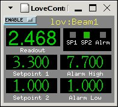
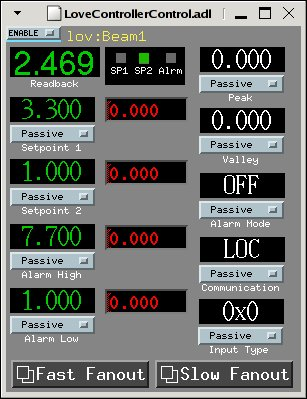
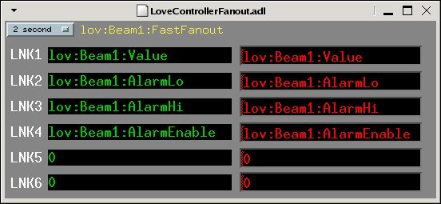
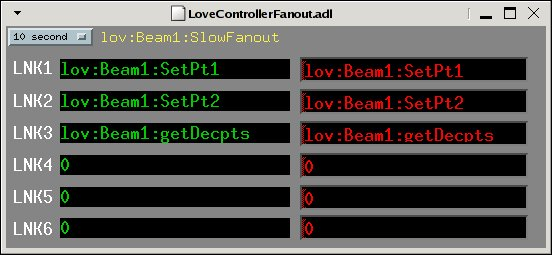

# User Guide
{: .no_toc}

## Table of contents
{: .no_toc .text-delta}

- TOC
{:toc}

## IOC Startup

### Using the iocsh snippet

The recommended way to configure Love controllers is with the
`love.iocsh` snippet. It handles serial port configuration, driver
initialization, and database loading for each controller instance.

```
iocshLoad("$(LOVE)/iocsh/love.iocsh", "PREFIX=ioc:, PORT=L0, SERIAL=S0, ADDR=0x01, INSTANCE=Love1, MODEL=1600")
iocshLoad("$(LOVE)/iocsh/love.iocsh", "PREFIX=ioc:, PORT=L0, SERIAL=S0, ADDR=0x02, INSTANCE=Love2, MODEL=16A")
```

The snippet macros are:

| Macro | Description |
| - | - |
| `PREFIX` | IOC PV prefix |
| `PORT` | Name for the Love driver's asyn port |
| `SERIAL` | Name of the asyn serial port (only needed for the first controller on a given port) |
| `ADDR` | Controller address on the RS-485 bus (hex) |
| `INSTANCE` | Controller instance name, used as a PV name component |
| `MODEL` | Controller model: `1600` or `16A` |

The serial port must be configured with `drvAsynSerialPortConfigure`
before the first `iocshLoad` call for a given `PORT`. The snippet
automatically sets serial options (19200 baud, 8N1, no flow control)
and calls `drvLoveInit` on the first invocation for each port.

### Manual configuration

For direct control over initialization, use the iocsh commands
individually. An asyn serial port must be configured first:

```
drvAsynSerialPortConfigure("S0", "/dev/ttyS0", 0, 0, 0)
asynSetOption("S0", 0, "baud", "19200")
asynSetOption("S0", 0, "bits", "8")
asynSetOption("S0", 0, "parity", "none")
asynSetOption("S0", 0, "stop", "1")
asynSetOption("S0", 0, "clocal", "Y")
asynSetOption("S0", 0, "crtscts", "N")
```

Then initialize the Love driver and configure each controller:

```
drvLoveInit("L0", "S0", 0)
drvLoveConfig("L0", 0x01, "1600")
drvLoveConfig("L0", 0x02, "1600")
drvLoveConfig("L0", 0x03, "16A")
```

`drvLoveInit` creates the asyn port driver and connects it to the
serial port. `drvLoveConfig` registers a controller at the given
address (1--256, hex) with the specified model.

After configuration, load the database records for each controller:

```
dbLoadRecords("$(LOVE)/db/LoveController.db", "P=ioc:, Q=Love1:, PORT=L0, ADDR=0x01")
dbLoadRecords("$(LOVE)/db/LoveControllerControl.db", "P=ioc:, Q=Love1:, PORT=L0, ADDR=0x01")
```

An example IOC is provided under `iocs/loveExIOC/`. See the startup
scripts in `iocs/loveExIOC/iocBoot/ioclove/` for complete Linux and
vxWorks examples.

## Database

The database consists of records for reading and controlling values on
the Love controllers. Two database files are provided:

| File | Description |
| - | - |
| `LoveController.db` | Read-back records: value, set points, alarm limits, peak, valley, communication status |
| `LoveControllerControl.db` | Configuration records: set point and alarm limit adjustment |

Both files use the following macros:

| Macro | Description |
| - | - |
| `P` | PV prefix (e.g., `ioc:`) |
| `Q` | Controller instance qualifier (e.g., `Love1:`) |
| `PORT` | Love driver asyn port name |
| `ADDR` | Controller address (hex) |

Records are organized into three categories:

- **Base records** read integer values directly from the controller
  (decimal points, set points, alarm limits, status).
- **Composite records** (calc records) combine base record values to
  produce floating-point representations. For example, a set point
  calc record uses the decimal points value and the raw set point
  integer to compute the actual set point.
- **Fanout records** drive the processing rate of the base and
  composite records. Two fanout records provide fast and slow
  processing rates, adjustable from the MEDM screens.

{: .important}
> The `getDecpts` PV must remain in the fast fanout record at all
> times. This value is required by many PVs to derive their
> floating-point values.

A save/restore request file (`Love_settings.req`) is also provided
for use with autosave.

## Operator Screens

The module includes operator interface screens in three formats:
MEDM (`.adl`), CSS-BOY (`.opi`), and caQtDM (`.ui`).

The main controller screen displays read-back values, set points,
alarm limits, and alarm status. An ENABLE menu allows
disabling/enabling record processing.



A hidden menu in the upper right corner of the main screen opens the
control display, which shows additional values (input type,
communication status) and allows adjustment of configuration
parameters such as set point 1 and scan rate.



The "Fast Fanout" and "Slow Fanout" buttons launch screens that list
the PVs being acquired and their processing rate. Users can add PVs
or change the rate at runtime.





{: .note}
> Changes made to fanout records at runtime are not preserved across
> IOC reboots. Modify the database records directly to make permanent
> changes.

## Wiring

Communication with the controllers uses half-duplex RS-485. An
RS-232 to RS-485 converter is required. See the
[WIRING](https://github.com/epics-modules/love/blob/master/docs/WIRING)
file for detailed pinout and wiring diagrams for a typical setup
using the B&B Electronics 485LDRC converter.

## Files

### Source

| File | Description |
| - | - |
| `loveApp/src/drvLove.c` | Asyn multi-device port driver |
| `loveApp/src/devLove.dbd` | DBD file for importing Love support into other applications |

### Database

| File | Description |
| - | - |
| `loveApp/Db/LoveController.db` | Read-back records |
| `loveApp/Db/LoveControllerControl.db` | Configuration records |
| `loveApp/Db/Love_settings.req` | Autosave request file |

### IOC Shell

| File | Description |
| - | - |
| `loveApp/iocsh/love.iocsh` | Reusable iocsh snippet for configuring a controller instance |

### Example IOC

| File | Description |
| - | - |
| `iocs/loveExIOC/iocBoot/ioclove/st.cmd.linux` | Linux startup script |
| `iocs/loveExIOC/iocBoot/ioclove/st.cmd.vx` | vxWorks startup script |

### Hardware Documentation

| Directory | Contents |
| - | - |
| `docs/1600/` | Model 1600 user manual, communication protocol, calibration |
| `docs/16A/` | Model 16A user manual, communication protocol, data sheet, calibration, flow chart |
| `docs/485LDRC/` | RS-232 to RS-485 converter data sheet, wiring and installation diagrams |
